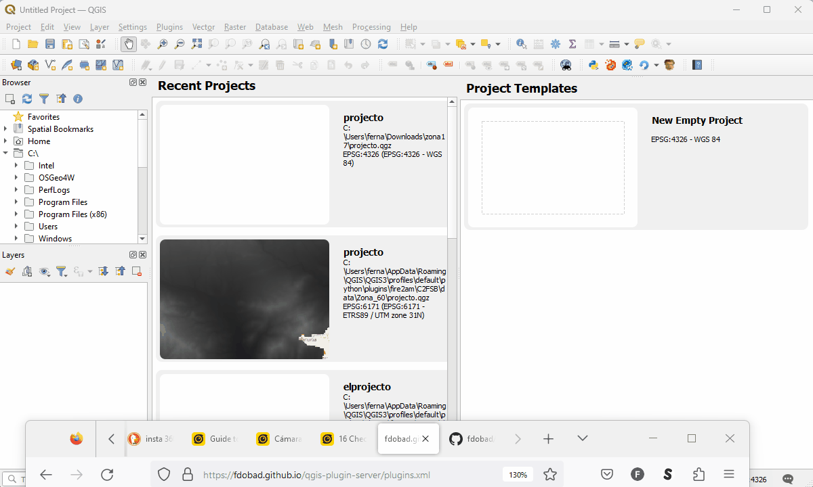
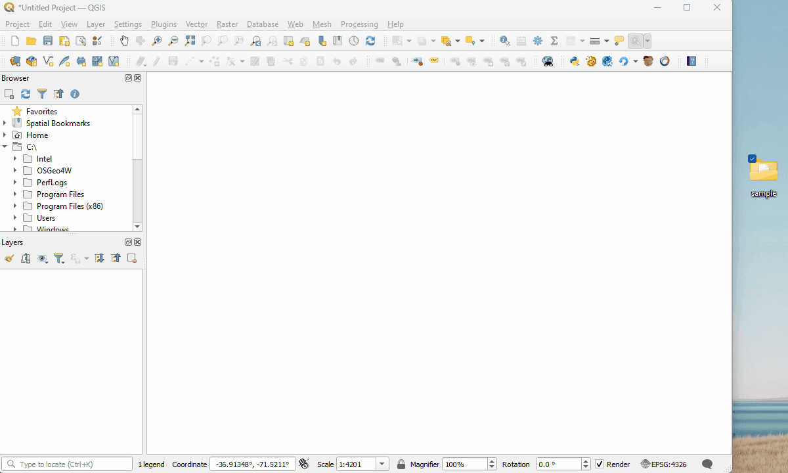
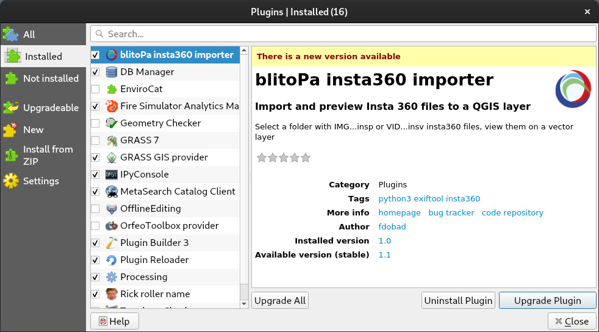

# Blitopa QGIS plugin

Import Insta360 media into a QGIS point layer, click to launch your favorite viewer.

# Installation
1. Add my plugin-repository: https://fdobad.github.io/qgis-plugin-server/plugins.xml
2. Type 'blitopa'
3. Click 'Install Plugin'  


Now you have a new icon  in the plugin toolbar

# Usage
## Importing
Select a folder with '.insp' files inside, click 'Ok'.
_new point layer will be displayed, named as the folder with the geolocalized photos._
- Missing tags will be interpolated
- Open the Log Messages panel to check progress or report on broken files
- Disable Logs to speed up

## Viewing
- Once per new layer: Click on the "Run Feature Action" (looks like a cog with a play button being clicked) configuration (the dropdown next to it): select 'Open File'
- Select the correct layer, click on a point to launch your default viewer program  



Installing insta360-Player is [recommended](https://descargar.freedownloadmanager.org/Windows-PC/Insta360-Player/GRATIS-2.3.6.html)

### Upgrade dialog


# Development:
### Insta360 files:
- 2 spherical fish eye format  
- Video IMG_YYYYMMDD_100902_00_001.insv
- Image IMG_YYYYMMDD_100902_00_001.insp

### RoadMap
1. Extract Metadata from images and videos 100%
2. read metadata into QGIS layer 75% : todo video and pics options
3. put a link in each waypoint to the picture
4. Stitch two fish eye images to get 360° panorama: https://github.com/rnbguy/FishPyPano
    - transform to thumbnail ?
    - transform a fisheye image into a normal perspective: https://github.com/duducosmos/defisheye
5. put a thumbnail in each waypoints: https://gis.stackexchange.com/questions/306014/how-to-put-geotagged-jpg-thumbnails-on-a-map-in-qgis#306073

## ALGO
### Extract metadata with exiftool
[exif cli documentation](https://exiftool.org/exiftool_pod.html)  

#### Some Basic Usage
1. Get 1st level tags 
```
exiftool FILE
```
2. Get all embedded tags  
```
exiftool -extractEmbedded FILE
exiftool -ee3 FILE
exiftool -ee -G3 FILE
```
3. Generation of GPS track logs from timed metadata in videos  
```
exiftool -ee -p FILE
```
4. LargeFileSupport (1.4GB insv didnt need it)
```
exiftool -api largefilesupport=1 FILE
```
5. all matching extension from directory
```
exiftool -ext insp dir
```
6. discard warnings & errors, display and write results
```
exiftool -ext insp dir 2>/dev/null | tee results.txt
```
7. ignoreMinorErrors makes it slower
8. datetime
```
${GPSDateTime} -> 2022:01:05 15:31:35Z
${GPSDateTime;DateFmt("%s")} -> 1641396695
${CreateDate;DateFmt("%s")}
```

### insp
```
./exiftool -s -ee IMG...insp > insp_all_tags.txt
./exiftool -ee -p '${creationdate} ${gpslatitude#} ${gpslongitude#} ${gpsaltitude#}' 
./exiftool -s -ee3 -p '$ImageDescription $CreateDate $gpslatitude $gpslongitude $gpsaltitude' ~/directory/ 2>/dev/null | tee output.txt
./exiftool -s -ee3 -p '$ImageDescription $CreateDate ${gpslatitude#} ${gpslongitude#} ${gpsaltitude#}'

blitopa/source/Image-ExifTool-12.62/exiftool -s -ee3 -p '$ImageDescription,${CreateDate;DateFmt("%s")},${gpslatitude#},${gpslongitude#},${gpsaltitude#}' -ext insp blitopa/data/RodriAbogado/Camera01/ 2>/dev/null | tee exif_output.csv
```

### insv
#### Table 
```
./exiftool -ee -p '${GPSDateTime;DateFmt("%s")} ${gpslatitude#} ${gpslongitude#} ${gpsaltitude#}' FILE.insv 2>/dev/null | tee output.txt
1641396695 -42.9271283370619 -72.7127696291493 9.61716718319803
1641396695 -42.9271283370619 -72.7127696291493 9.61716718319803
1641396695 -42.9271283370619 -72.7127696291493 9.61716718319803

./exiftool -api largefilesupport -ee -p '${GPSDateTime} ${gpslatitude#} ${gpslongitude#} ${gpsaltitude#} ${gpsspeed#} ${gpstrack#}' FILE 2>/dev/null | tee
2022:01:05 15:31:35Z -42.9271283370619 -72.7127696291493 9.61716718319803 0 187.130266798204
2022:01:05 15:31:35Z -42.9271283370619 -72.7127696291493 9.61716718319803 0 187.130266798204
2022:01:05 15:31:35Z -42.9271283370619 -72.7127696291493 9.61716718319803 0 187.130266798204

[Doc819]        GPS Date/Time                   : 2022:01:05 15:32:03Z                                                                       
[Doc819]        GPS Latitude                    : 42 deg 55' 37.66" S                                                                        
[Doc819]        GPS Longitude                   : 72 deg 42' 45.95" W                                                                        
[Doc819]        GPS Speed                       : 0                                                                                          
[Doc819]        GPS Track                       : 187.1303                                                                                   
```
#### gpx
```
./exiftool -ee -api largefilesupport -p gpx.fmt FILE.insv > FILE.gpx

$ista/exiftool/exiftool -ee -api largefilesupport=1 -p result/insv_gpx.fmt data/largeVideo/VID_20220105_122731_00_051.insv 2>/dev/null 
| tee result/largeVideo00.gpx
```

# related
```
# list insv files and get size
find . -name '*.insv' -exec du -h '{}' \;
```

# references
[Exif forum insta360 post](https://exiftool.org/forum/index.php?topic=9884.30)
[Extract GPS Data from .insv. insta360 forum](https://forums.insta360.com/section/14/post/5415/)
[exiftool](https://exiftool.org/)
https://github.com/exiftool/exiftool

# other
[c++ image conversion](https://github.com/chinhsuanwu/360-converter/blob/master/example/example.cpp)
https://github.com/tu-darmstadt-ros-pkg/image_projection
https://github.com/sunset1995/py360convert
https://github.com/timy90022/Perspective-and-Equirectangular
https://photo-sphere-viewer.js.org
https://docs.qgis.org/3.28/en/docs/user_manual/working_with_gps/live_GPS_tracking.html
